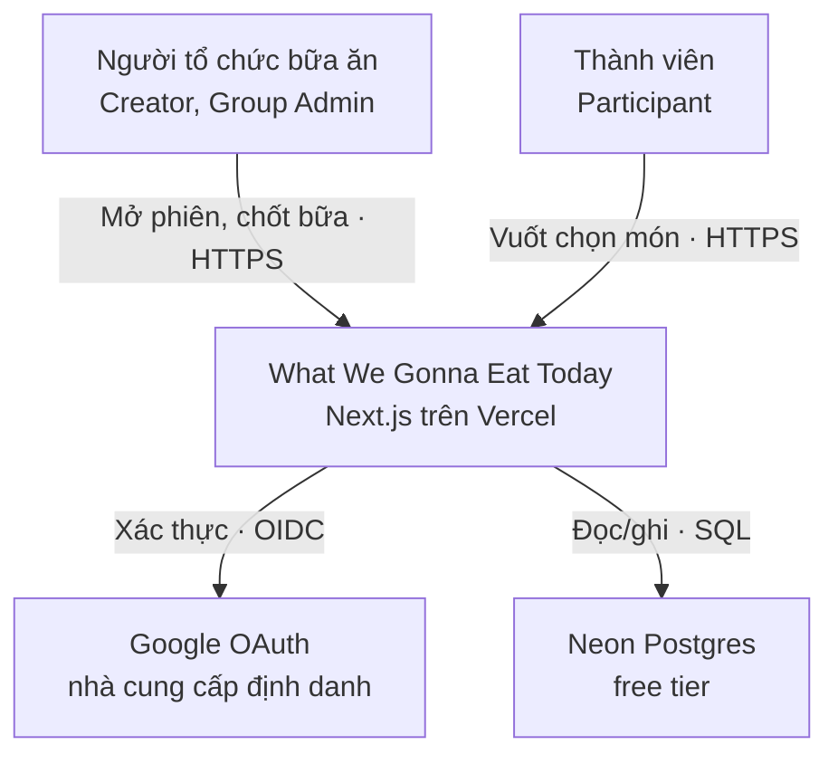
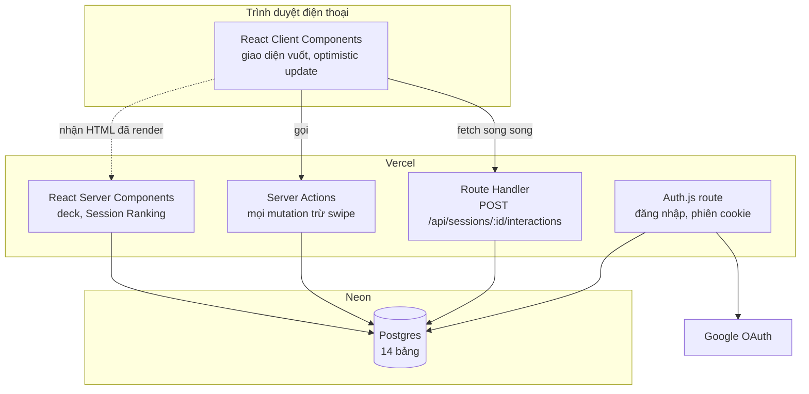
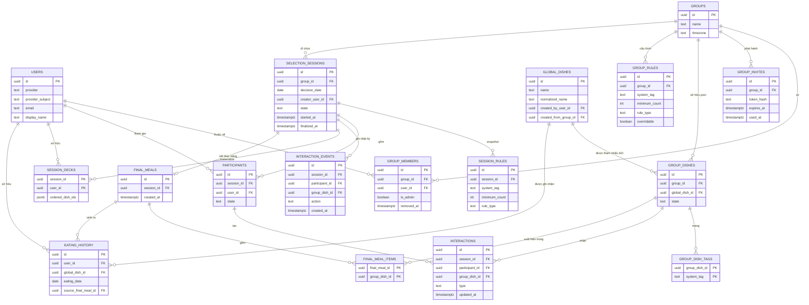
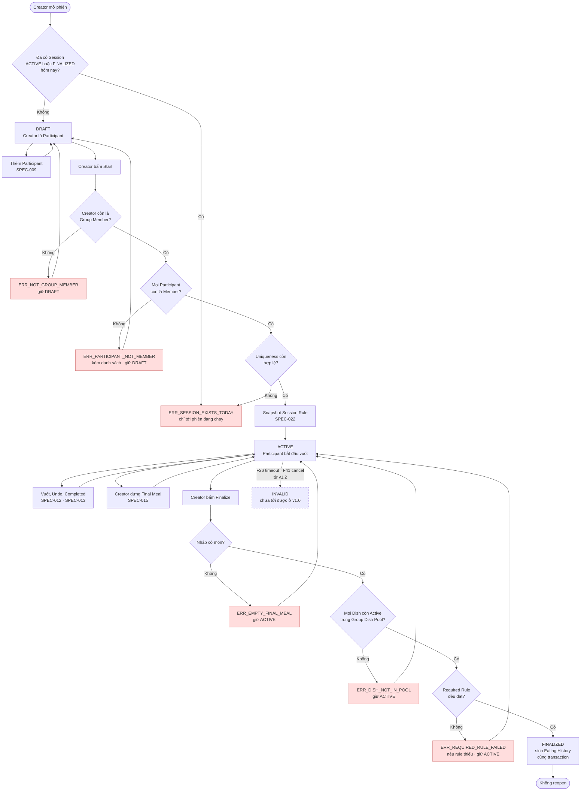
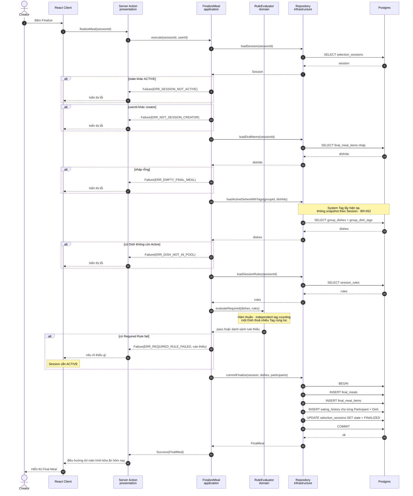

# Diagrams — What We Gonna Eat Today

## Version 0.1

**Status:** Draft — Awaiting review
**Created:** 2026-08-14
**Upstream:** Tech Spec & Architecture v0.1, SDD v0.2, Business Rules v1.6

Phạm vi: **v1.0 — 17 tính năng**. Sơ đồ không mô tả các tính năng ở v1.1 và v1.2.

Tất cả bằng Mermaid để render được trên GitHub và diff được bằng git. Bốn sơ đồ nằm chung một file thay vì tách thư mục, để thống nhất với bộ tài liệu phẳng hiện có của dự án.

C4 chỉ có Context và Container. Component và Code bị bỏ: tầng Code chính là source code, còn Component sẽ lỗi thời trong tuần đầu tiên. Cả hai sơ đồ C4 dùng `flowchart` thay cú pháp `C4Context`, vì cú pháp C4 của Mermaid hay hỏng ở một số nơi render.

---

# 1. C4 — Context

Dùng để quyết định: hệ thống phụ thuộc vào cái gì bên ngoài, và ai chạm vào nó.

Chỉ có hai phụ thuộc ngoài. Không có dịch vụ thanh toán, không có email, không có thông báo đẩy, không có lưu trữ file. Mỗi mũi tên thêm vào sơ đồ này là một thứ có thể hỏng lúc 6 giờ chiều khi cả nhà đang chờ.

---

# 2. C4 — Container

Dùng để quyết định: cái gì chạy ở đâu, và ranh giới nào không được vượt.

Quyết định duy nhất đáng vẽ ở đây: **swipe đi qua Route Handler riêng, không qua Server Action.** React serialise các Server Action liên tiếp, còn NFR-02 yêu cầu phản hồi dưới 100ms khi người dùng vuốt liên tục. Mọi mutation khác đi qua Server Action vì chúng thưa và không cần song song.

---

# 3. ERD

Dùng để quyết định: dữ liệu nào là nguồn sự thật, và ràng buộc nào do database ép chứ không do code.

## 3.1 Ràng buộc bắt nguồn từ business rule

| Ràng buộc | Nguồn | Ép ở đâu |
|---|---|---|
| Unique một phần trên `(group_id, decision_date)` khi `state in (ACTIVE, FINALIZED)` | BR-025 | Database |
| `unique(group_id, rule_type, system_tag)` | BR-012 | Database |
| `check(minimum_count >= 1)` trên cả `group_rules` và `session_rules` | BR-012 | Database |
| `unique(session_id, participant_id, group_dish_id)` trên `interactions` | BR-040 | Database |
| `primary key(final_meal_id, group_dish_id)` — một Dish một lần trong Final Meal | BR-050 | Database |
| `unique(group_id, global_dish_id)` trên `group_dishes` | BR-005 | Database |
| `unique(session_id)` trên `final_meals` — tối đa một Final Meal mỗi Session | BR-025 | Database |
| Participant phải là Group Member | BR-026 | Application, vì membership có thể bị gỡ sau khi tham gia |
| Mọi Dish trong Final Meal phải Active lúc finalize | BR-050 | Application, kiểm tra lại tại SPEC-016 bước 4 |

Chín ràng buộc, bảy trong số đó do database ép. Đây là chủ ý: ràng buộc do code ép sẽ bị bỏ sót ở đường đi thứ hai, còn ràng buộc do database ép thì không.

## 3.2 Ba chỗ lệch so với Tech Spec v0.1

Đối chiếu ERD với mô hình dữ liệu ở Tech Spec §3.1 và từ vựng ở Business Rules, tôi thấy ba chỗ cần sửa. Chúng chưa được áp dụng vào Tech Spec, chờ bạn duyệt.

**1. Đổi tên bảng `sessions` thành `selection_sessions`.**
Business Rules gọi thực thể này là Selection Session. Quan trọng hơn, `sessions` là tên Auth.js dùng cho phiên đăng nhập; v1.0 chọn chiến lược JWT nên chưa có bảng đó, nhưng nếu sau này đổi sang database session thì va tên ngay. Đổi bây giờ tốn một dòng, đổi sau tốn một migration.

**2. Bỏ `group_id` và `decision_date` khỏi `final_meals`.**
Tech Spec §3.1 để hai cột này, nhưng cả hai đều suy ra được từ `selection_sessions` qua `session_id`. Dữ liệu trùng lặp sẽ lệch nhau vào một ngày nào đó, và không có ràng buộc nào giữ chúng đồng bộ. `eating_history.eating_date` thì phải giữ, vì nó là dữ liệu ở cấp User và được Personal Correction sửa độc lập từ v1.1.

**3. Bỏ cột `invalid_reason` khỏi `selection_sessions` ở v1.0.**
Trạng thái `INVALID` không thể tới được ở v1.0 vì F26 timeout và F41 cancel đều ở v1.2. Giữ giá trị `INVALID` trong enum thì hợp lý — nó mô tả máy trạng thái đầy đủ và không tốn gì. Nhưng cột `invalid_reason` là cột chết, và nó vi phạm đúng nguyên tắc đã dùng để loại `is_chef` ở Tech Spec §3.2.

---

# 4. Flowchart — Vòng đời Selection Session

Dùng để quyết định: một phiên có thể kết thúc ở những trạng thái nào, và cái gì chặn nó ở mỗi bước.

Nhánh lỗi được vẽ đầy đủ. Sơ đồ chỉ có happy path không giúp ai quyết định gì.

Điều đáng chú ý nhất trong sơ đồ này: **mọi nhánh lỗi đều quay về trạng thái cũ.** Không có trạng thái `ValidationFailed`, không có phiên nào bị kẹt ở giữa. Đây là DEC-011 được vẽ ra, và nó là lý do máy trạng thái chỉ có bốn ô thay vì bảy.

Đường đứt nét tới `INVALID` cho thấy phần máy trạng thái chưa dùng được ở v1.0. Một phiên mở hôm nay sẽ ở `ACTIVE` vĩnh viễn nếu không ai chốt.

---

# 5. Sequence — Finalize

Dùng để quyết định: ranh giới tầng nào bị vượt qua ở luồng phức tạp nhất, và giao dịch bao trùm những gì.

Vẽ cho Finalize vì đây là chỗ duy nhất trong v1.0 mà bốn feature chạm nhau — `meal`, `rule`, `session`, `history` — và là chỗ duy nhất có transaction nhiều bảng.

Ba điều sơ đồ này ép phải đúng:

1. **`RuleEvaluator` nằm ở `domain/` và là hàm thuần.** Nó không chạm database, nhận `dishes` và `rules` làm tham số. Đây là điều kiện để test nó không cần dựng Session — và nó là một trong ba chỗ Tech Spec §8.2 yêu cầu test kỹ nhất.
2. **Bốn lệnh ghi nằm trong một transaction.** Nếu `eating_history` ghi thất bại thì Session không được chuyển sang `FINALIZED`. Không có trạng thái nửa vời nào tồn tại được.
3. **System Tag đọc ở bước gần cuối, không phải lúc dựng nháp.** BR-052 yêu cầu validate bằng tag hiện tại, nên Admin đổi tag lúc 5 giờ chiều sẽ đổi kết quả finalize lúc 6 giờ. Đây là hành vi có chủ ý, không phải lỗi.

---

# 6. Kiểm tra cuối

- Tên gọi thống nhất giữa bốn sơ đồ, Tech Spec §3.1 và từ vựng Business Rules — trừ ba chỗ lệch đã nêu ở §3.2, đang chờ duyệt.
- Cả bốn sơ đồ dùng cú pháp Mermaid phổ biến (`flowchart`, `erDiagram`, `sequenceDiagram`), tránh `C4Context` vì hay hỏng khi render.
- Mỗi sơ đồ có câu mở đầu nói rõ nó dùng để quyết định điều gì.
- Không sơ đồ nào diễn đạt lại code. Sơ đồ nào chỉ vẽ lại cấu trúc thư mục đã bị bỏ.

---

# 7. Change History

| Version | Date | Section | Change | Reason / Decision |
|---|---|---|---|---|
| 0.1 | 2026-08-14 | Toàn bộ | Bản draft đầu tiên: C4 Context/Container, ERD 15 bảng, flowchart vòng đời Session, sequence Finalize | Phase 7 |
