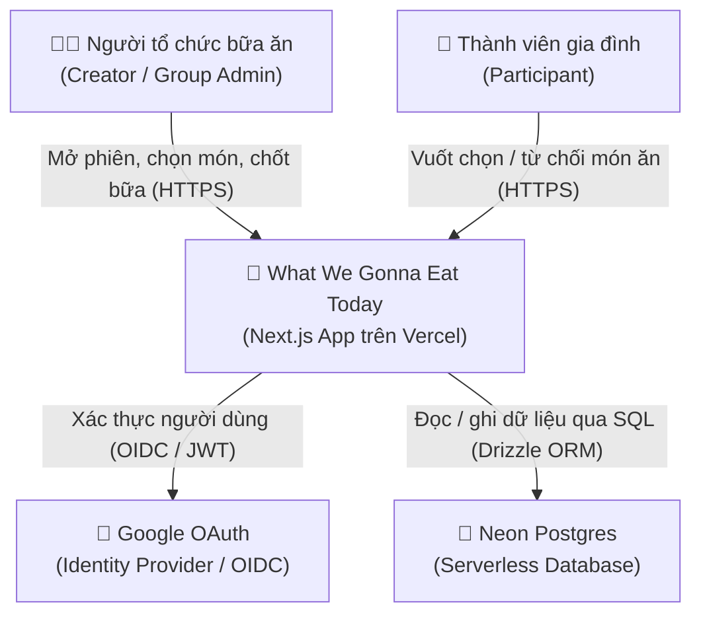
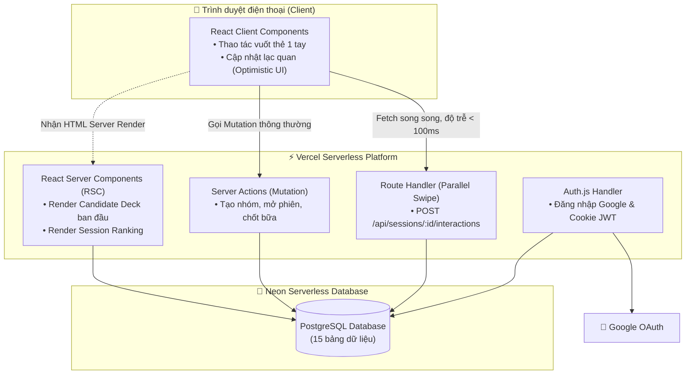
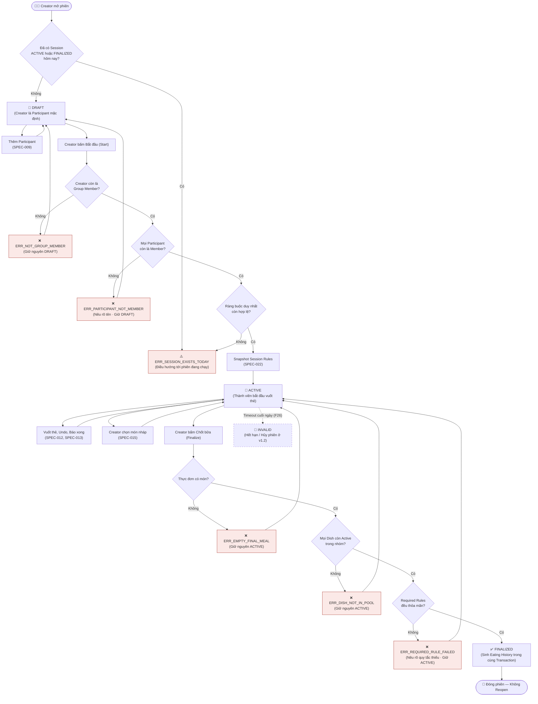
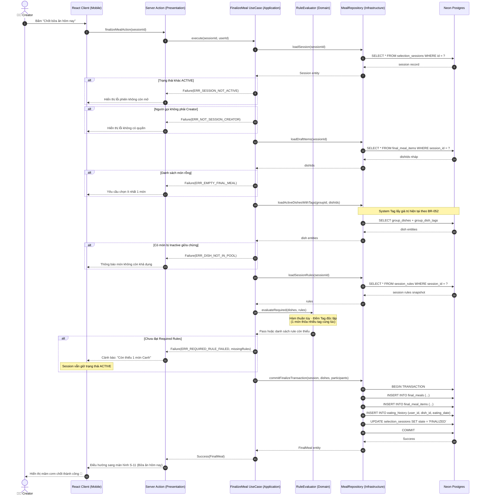

# 📐 Architecture & System Diagrams — What We Gonna Eat Today

> **Document Metadata**
>
> - **Version:** `1.0` | **Status:** `Approved`
> - **Created:** `2026-08-14` | **Last Updated:** `2026-08-14`
> - **Upstream:** [Tech Spec & Architecture](what-we-gonna-eat-today_tech-spec-architecture_v0_1.md) • [SDD](what-we-gonna-eat-today_sdd_v0_1.md) • [Business Rules](what-we-gonna-eat-today_business-rules_v1.4.md)
> - **Downstream:** [Master Plan](what-we-gonna-eat-today_master-plan_v1_0.md) • [Setup & Ops Guide](what-we-gonna-eat-today_setup-and-ops-guide_v0_1.md)
>
> 📌 *Tài liệu trực quan hóa toàn diện hệ thống What We Gonna Eat Today: Sơ đồ C4 Context & Container, Sơ đồ thực thể quan hệ ERD (15 bảng), Flowchart vòng đời phiên chọn món và Sequence Diagram luồng Finalize.*

---

## 📑 Mục lục (Table of Contents)

1. [Sơ đồ C4 — Bối cảnh hệ thống (System Context)](#1-sơ-đồ-c4--bối-cảnh-hệ-thống-system-context)
2. [Sơ đồ C4 — Vùng chứa & Thành phần (Containers)](#2-sơ-đồ-c4--vùng-chứa--thành-phần-containers)
3. [Sơ đồ thực thể quan hệ (ERD — Entity Relationship Diagram)](#3-sơ-đồ-thực-thể-quan-hệ-erd--entity-relationship-diagram)
   - [3.1 Bảng phân tích các ràng buộc nghiệp vụ](#31-bảng-phân-tích-các-ràng-buộc-nghiệp-vụ)
   - [3.2 Các quyết định đồng bộ Schema](#32-các-quyết-định-đồng-bộ-schema)
4. [Lưu đồ vòng đời phiên chọn món (Session Lifecycle Flowchart)](#4-lưu-đồ-vòng-đời-phiên-chọn-món-session-lifecycle-flowchart)
5. [Sơ đồ tuần tự chốt bữa ăn (Finalize Sequence Diagram)](#5-sơ-đồ-tuần-tự-chốt-bữa-ăn-finalize-sequence-diagram)
6. [Lịch sử thay đổi (Change History)](#6-lịch-sử-thay-đổi-change-history)

---

# 1. Sơ đồ C4 — Bối cảnh hệ thống (System Context)

> **Mục đích:** Xác định rõ các phụ thuộc bên ngoài của hệ thống và các tác nhân tương tác.

> [!NOTE]
> Hệ thống chỉ duy trì **2 phụ thuộc ngoại vi cốt lõi**: Google OAuth (định danh) và Neon Postgres (lưu trữ). Không có dịch vụ thanh toán, không email, không push notification thừa thãi nhằm đảm bảo độ tin cậy tối đa lúc 6 giờ chiều khi cả nhà đang chờ cơm.

---

# 2. Sơ đồ C4 — Vùng chứa & Thành phần (Containers)

> **Mục đích:** Phân định rõ ranh giới thực thi: Thành phần nào chạy ở trình duyệt, thành phần nào chạy trên server và giao tiếp như thế nào.

> [!IMPORTANT]
> **Quyết định kiến trúc quan trọng:**  
> Thao tác vuốt thẻ (Swipe) đi qua **Route Handler riêng**, không qua Server Actions để tránh bị nghẽn hàng đợi (serialisation) của React, đáp ứng chỉ số [NFR-02](what-we-gonna-eat-today_prd_v0_1.md) phản hồi dưới 100ms.

---

# 3. Sơ đồ thực thể quan hệ (ERD — Entity Relationship Diagram)

> **Mục đích:** Xác định cấu trúc nguồn sự thật (Single Source of Truth) và các ràng buộc toàn vẹn do Database kiểm soát.

```mermaid
erDiagram
    USERS ||--o{ GROUP_MEMBERS : "thuộc về"
    GROUPS ||--o{ GROUP_MEMBERS : "có"
    GROUPS ||--o{ GROUP_INVITES : "phát hành"
    GROUPS ||--o{ GROUP_DISHES : "sở hữu pool"
    GLOBAL_DISHES ||--o{ GROUP_DISHES : "được tham chiếu bởi"
    GROUP_DISHES ||--o{ GROUP_DISH_TAGS : "mang"
    GROUPS ||--o{ GROUP_RULES : "cấu hình"
    GROUPS ||--o{ SELECTION_SESSIONS : "tổ chức"
    SELECTION_SESSIONS ||--o{ SESSION_RULES : "snapshot"
    SELECTION_SESSIONS ||--o{ PARTICIPANTS : "gồm"
    USERS ||--o{ PARTICIPANTS : "tham gia"
    PARTICIPANTS ||--o{ INTERACTIONS : "tạo"
    GROUP_DISHES ||--o{ INTERACTIONS : "nhận"
    SELECTION_SESSIONS ||--o{ INTERACTION_EVENTS : "ghi nhật ký"
    SELECTION_SESSIONS ||--o{ SESSION_DECKS : "materialize"
    USERS ||--o{ SESSION_DECKS : "sở hữu"
    SELECTION_SESSIONS ||--o| FINAL_MEALS : "kết thúc bằng"
    FINAL_MEALS ||--o{ FINAL_MEAL_ITEMS : "gồm"
    GROUP_DISHES ||--o{ FINAL_MEAL_ITEMS : "xuất hiện trong"
    FINAL_MEALS ||--o{ EATING_HISTORY : "sinh ra"
    USERS ||--o{ EATING_HISTORY : "sở hữu"
    GLOBAL_DISHES ||--o{ EATING_HISTORY : "được ghi nhận"

    USERS {
        uuid id PK
        text provider
        text provider_subject
        text email
        text display_name
        timestamptz created_at
    }
    GROUPS {
        uuid id PK
        text name
        text timezone
        timestamptz created_at
    }
    GROUP_MEMBERS {
        uuid id PK
        uuid group_id FK
        uuid user_id FK
        boolean is_admin
        timestamptz joined_at
        timestamptz removed_at
    }
    GROUP_INVITES {
        uuid id PK
        uuid group_id FK
        text token_hash
        timestamptz expires_at
        timestamptz used_at
        uuid used_by_user_id FK
        timestamptz created_at
    }
    GLOBAL_DISHES {
        uuid id PK
        text name
        text normalized_name
        uuid created_by_user_id FK
        uuid created_from_group_id FK
        timestamptz created_at
    }
    GROUP_DISHES {
        uuid id PK
        uuid group_id FK
        uuid global_dish_id FK
        text state
        timestamptz created_at
    }
    GROUP_DISH_TAGS {
        uuid group_dish_id PK, FK
        text system_tag PK
    }
    GROUP_RULES {
        uuid id PK
        uuid group_id FK
        text system_tag
        int minimum_count
        text rule_type
        boolean overridable
    }
    SELECTION_SESSIONS {
        uuid id PK
        uuid group_id FK
        date decision_date
        uuid creator_user_id FK
        text state
        timestamptz created_at
        timestamptz started_at
        timestamptz finalized_at
    }
    SESSION_RULES {
        uuid id PK
        uuid session_id FK
        text system_tag
        int minimum_count
        text rule_type
    }
    PARTICIPANTS {
        uuid id PK
        uuid session_id FK
        uuid user_id FK
        text state
        timestamptz joined_at
    }
    INTERACTIONS {
        uuid id PK
        uuid session_id FK
        uuid participant_id FK
        uuid group_dish_id FK
        text type
        timestamptz updated_at
    }
    INTERACTION_EVENTS {
        uuid id PK
        uuid session_id FK
        uuid participant_id FK
        uuid group_dish_id FK
        text action
        timestamptz created_at
    }
    SESSION_DECKS {
        uuid session_id PK, FK
        uuid user_id PK, FK
        jsonb ordered_dish_ids
        timestamptz created_at
    }
    FINAL_MEALS {
        uuid id PK
        uuid session_id FK
        timestamptz created_at
    }
    FINAL_MEAL_ITEMS {
        uuid final_meal_id PK, FK
        uuid group_dish_id PK, FK
    }
    EATING_HISTORY {
        uuid id PK
        uuid user_id FK
        uuid global_dish_id FK
        date eating_date
        uuid source_final_meal_id FK
        timestamptz created_at
    }
```

## 3.1 Bảng phân tích các ràng buộc nghiệp vụ

| Ràng buộc toàn vẹn | Nguồn quy tắc | Tầng thực thi |
| :--- | :--- | :---: |
| **Partial Unique:** `(group_id, decision_date)` khi `state IN ('ACTIVE', 'FINALIZED')` | [BR-025](what-we-gonna-eat-today_business-rules_v1.4.md) | **Database** |
| `UNIQUE(group_id, rule_type, system_tag)` | [BR-012](what-we-gonna-eat-today_business-rules_v1.4.md) | **Database** |
| `CHECK(minimum_count >= 1)` trên cả `group_rules` và `session_rules` | [BR-012](what-we-gonna-eat-today_business-rules_v1.4.md) | **Database** |
| `UNIQUE(session_id, participant_id, group_dish_id)` trên `interactions` | [BR-040](what-we-gonna-eat-today_business-rules_v1.4.md) | **Database** |
| `PRIMARY KEY(final_meal_id, group_dish_id)` (Một món xuất hiện 1 lần trong thực đơn) | [BR-050](what-we-gonna-eat-today_business-rules_v1.4.md) | **Database** |
| `UNIQUE(group_id, global_dish_id)` trên `group_dishes` | [BR-005](what-we-gonna-eat-today_business-rules_v1.4.md) | **Database** |
| `UNIQUE(session_id)` trên `final_meals` (Tối đa 1 Final Meal cho mỗi Session) | [BR-025](what-we-gonna-eat-today_business-rules_v1.4.md) | **Database** |
| Participant bắt buộc phải là Group Member | [BR-026](what-we-gonna-eat-today_business-rules_v1.4.md) | **Application** |
| Mọi Dish trong Final Meal phải Active tại thời điểm finalize | [BR-050](what-we-gonna-eat-today_business-rules_v1.4.md) | **Application** |

## 3.2 Các quyết định đồng bộ Schema

1. **Đổi tên `sessions` $\to$ `selection_sessions`:** Tránh xung đột với bảng session của Auth.js / NextAuth.
2. **Loại bỏ `group_id` và `decision_date` khỏi `final_meals`:** Cả hai trường đều suy ra được qua `session_id`, loại bỏ dữ liệu dư thừa.
3. **Loại bỏ `invalid_reason` ở v1.0:** Trạng thái `INVALID` chỉ kích hoạt từ v1.1+ (F26 Timeout, F41 Cancel).

---

# 4. Lưu đồ vòng đời phiên chọn món (Session Lifecycle Flowchart)

> **Mục đích:** Mô tả đầy đủ các trạng thái và điểm rẽ nhánh xử lý lỗi trong vòng đời một phiên chọn món.

> [!NOTE]
> Mọi nhánh lỗi nghiệp vụ đều **quay trở về trạng thái cũ an toàn** (`DRAFT` hoặc `ACTIVE`). Không có trạng thái trung gian bị treo hay dữ liệu rác.

---

# 5. Sơ đồ tuần tự chốt bữa ăn (Finalize Sequence Diagram)

> **Mục đích:** Minh họa ranh giới Clean Architecture và giao dịch nguyên tử (Atomic Transaction) khi thực thi Finalize Meal.

---

# 6. Lịch sử thay đổi (Change History)

| Version | Ngày | Phần tác động | Nội dung thay đổi | Cơ sở / Quyết định |
| :---: | :---: | :--- | :--- | :--- |
| `0.1` | 2026-08-14 | Toàn bộ | Bản thảo đầu tiên: C4 Context/Container, ERD 15 bảng, Flowchart và Sequence | Khởi tạo baseline thiết kế hệ thống |
