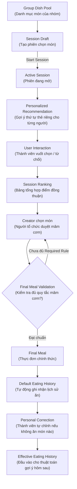

# 💡 Problem Definition — What We Gonna Eat Today

> **Document Metadata**
>
> - **Version:** `1.4` | **Status:** `Approved`
> - **Last Updated:** `2026-08-14` | **Supersedes:** `v1.3`
> - **Upstream:** Khảo sát hành vi & Nhu cầu thực tế
> - **Downstream:** [PRD](what-we-gonna-eat-today_prd_v1.5.md) • [Business Rules](what-we-gonna-eat-today_business-rules_v1.8.md) • [Tech Spec & Architecture](what-we-gonna-eat-today_tech-spec-architecture_v1.2.md)

---

## 📑 Mục lục (Table of Contents)

1. [Định nghĩa bài toán (Problem Definition)](#1-định-nghĩa-bài-toán-problem-definition)
2. [Tuyên bố vấn đề (Problem Statement)](#2-tuyên-bố-vấn-đề-problem-statement)
3. [Mục tiêu sản phẩm (Product Objective)](#3-mục-tiêu-sản-phẩm-product-objective)
4. [Đối tượng người dùng & Bối cảnh (Users & Context)](#4-đối-tượng-người-dùng--bối-cảnh-users--context)
5. [Phạm vi ra quyết định cốt lõi (Core Decision Scope)](#5-phạm-vi-ra-quyết-định-cốt-lõi-core-decision-scope)
6. [Thực thể miền trung tâm (Core Domain Concept)](#6-thực-thể-miền-trung-tâm-core-domain-concept)
7. [Dữ liệu đầu vào (Inputs)](#7-dữ-liệu-đầu-vào-inputs)
8. [Dữ liệu đầu ra (Outputs)](#8-dữ-liệu-đầu-ra-outputs)
9. [Luồng luân chuyển dữ liệu chính (Product Flow)](#9-luồng-luân-chuyển-dữ-liệu-chính-product-flow)
10. [Phạm vi phiên bản hiện tại (Current Scope)](#10-phạm-vi-phiên-bản-hiện-tại-current-scope)
11. [Ngoài phạm vi (Out of Scope)](#11-ngoài-phạm-vi-out-of-scope)
12. [Lịch sử thay đổi (Change History)](#12-lịch-sử-thay-đổi-change-history)

---

# 1. Định nghĩa bài toán (Problem Definition)

**What We Gonna Eat Today** là hệ thống hỗ trợ các nhóm nhỏ (trước mắt là gia đình) nhanh chóng quyết định **tập hợp các món ăn (Dish Set) sẽ dùng trong ngày hiện tại**.

Trong mỗi phiên chọn món (**Selection Session**), hệ thống:

1. Cá nhân hóa việc khám phá món ăn (**Personalized Candidate Deck**) cho từng thành viên (**Participant**).
2. Thu thập các tương tác chọn/bỏ qua (**Interactions**) nhanh gọn.
3. Tổng hợp thành bảng xếp hạng đồng thuận (**Session Ranking**) để hỗ trợ Người tổ chức (**Creator**) chốt thực đơn chính thức (**Final Meal**).

> [!NOTE]
> **Các nguyên tắc ranh giới cơ bản:**
>
> - **Món ăn (Dish)** là đơn vị gợi ý và ra quyết định cốt lõi.
> - Quyết định được thực hiện trong ngữ cảnh của một **Group** và một **Decision Date** cụ thể.
> - Vòng đời phiên chọn món: `Draft → Active → Finalized / Invalid`.
> - **Creator** là người ra quyết định cuối cùng — hệ thống đóng vai trò *Hỗ trợ quyết định (Decision Support)* chứ **không tự động chọn thay con người**.

---

# 2. Tuyên bố vấn đề (Problem Statement)

Việc trả lời câu hỏi **“Hôm nay chúng ta ăn gì?”** là một quyết định lặp lại mỗi ngày nhưng thường tiêu tốn rất nhiều thời gian và năng lượng tinh thần (cognitive effort).

### 🔍 Nguyên nhân cốt lõi

- **Hiệu ứng kẹt vùng quen thuộc (Availability Bias):** Mỗi người thường chỉ nhớ được 3–5 món quen trong đầu, dù thực tế gia đình có thể nấu được cả trăm món.
- **Xung đột & Khẩu vị phân tán:** Mỗi thành viên có sở thích, món kiêng kỵ và lịch sử ăn uống khác nhau.
- **Rào cản thảo luận:** Thành viên bận rộn ngại đọc danh sách dài và ngại tranh luận dài dòng.
- **Gánh nặng cho người nấu:** Người nấu phải tự nhớ ai không ăn được gì, hôm qua đã ăn gì để tránh lặp món.

> [!IMPORTANT]
> **Vấn đề cốt lõi:**  
> Không phải vì thiếu món để ăn, mà vì **rất khó thu hẹp một không gian lựa chọn lớn thành một danh sách phù hợp với từng cá nhân, đồng thời tổng hợp các tín hiệu phân tán trong nhóm thành dữ liệu trực quan để một người có thể chốt nhanh chóng.**

---

# 3. Mục tiêu sản phẩm (Product Objective)

> [!TIP]
> **Triết lý sản phẩm:**  
> **`Personalized Dish Recommendation + Group Decision Support`**  
> *(Gợi ý món ăn cá nhân hoá + Hỗ trợ ra quyết định nhóm)*

Hệ thống tập trung vào 6 nhiệm vụ:

1. Thu hẹp không gian lựa chọn xuống danh sách thẻ gọn gàng.
2. Gợi ý nhắc nhớ các món lâu chưa ăn để đổi bữa.
3. Đưa các món có khả năng được yêu thích nhất lên đầu.
4. Thu thập nhanh tín hiệu Thích / Không thích qua cử chỉ vuốt thẻ (Swipe).
5. Làm rõ các vi phạm quy tắc mâm cơm (Required Rule) và món dị ứng/kiêng kỵ (Cannot Eat).
6. Cung cấp bức tranh toàn cảnh để Creator tự tin chốt thực đơn chỉ sau vài phút.

---

# 4. Đối tượng người dùng & Bối cảnh (Users & Context)

- **Use case chính:** Gia đình nhỏ cùng quyết định thực đơn cho ngày hôm nay.
- **Tính độc lập:** Mỗi Group là một không gian quyết định riêng biệt với danh mục món và quy tắc độc lập.
- **Vai trò trong phiên:**
  - **Creator:** Người mở phiên, điều phối và chốt thực đơn cuối cùng.
  - **Participant:** Thành viên tham gia vuốt thẻ chọn món.
  - **Group Admin:** Quản lý thành viên, danh mục món và quy định bữa ăn của nhóm.
  - **Chef (Tùy chọn):** Thành viên nấu chính (nếu bật Chef Mode).

---

# 5. Phạm vi ra quyết định cốt lõi (Core Decision Scope)

Hệ thống chỉ giải quyết câu hỏi: **Hôm nay cả nhà ăn những món gì?**

```text
┌────────────────────────────────────────────────────────┐
│ Final Meal (Thực đơn chốt trong ngày):                 │
│ 1. Cơm trắng                                           │
│ 2. Cá basa kho tộ                                      │
│ 3. Canh chua cá lóc                                    │
│ 4. Rau muống xào tỏi                                   │
└────────────────────────────────────────────────────────┘
```

> [!NOTE]
> Hệ thống **không phân chia chi tiết** món nào ăn sáng, món nào ăn trưa, món nào ăn tối; và không thực hiện meal planning cho tương lai.

---

# 6. Thực thể miền trung tâm (Core Domain Concept)

### 🍲 Món ăn (Dish)

- **Dish là thực thể trung tâm** của toàn bộ hệ thống.
- Đại diện cho một món ăn ở mức biến thể cụ thể (vd: *Cá basa kho tiêu*, *Cá lóc kho tộ* là hai Dish riêng).
- Địa chỉ quán xá hoặc nguồn mua đồ là metadata bổ trợ gắn kèm món.
- **Global Dish Pool:** Catalog dùng chung toàn hệ thống, tự động phát hiện trùng lặp khi tạo mới.

---

# 7. Dữ liệu đầu vào (Inputs)

```text
┌──────────────────────────────────────────────────────────────────────────┐
│                             INPUTS CONTEXT                               │
├───────────────────┬───────────────────┬──────────────────┬───────────────┤
│ 1. Group Context  │ 2. Session Context│ 3. User Context  │ 4. Dish       │
├───────────────────┼───────────────────┼──────────────────┼───────────────┤
│ • Danh sách Member│ • Vòng đời phiên  │ • Cannot Eat     │ • Tên & ID    │
│ • Group Roles     │ • Creator         │ • Like / Dislike │ • System Tags │
│ • Group Dish Pool │ • Participant list│ • Blacklist      │ • Nguồn mua   │
│ • Group Rules     │ • Decision Date   │ • Eating History │ • Người tạo   │
│ • Múi giờ nhóm    │ • Session Rules   │ • Khả năng nấu   │               │
└───────────────────┴───────────────────┴──────────────────┴───────────────┘
```

---

# 8. Dữ liệu đầu ra (Outputs)

1. **Personalized Candidate List:** Danh sách thẻ món ăn được cá nhân hóa cho từng người (thứ tự hiển thị khác nhau tùy theo sở thích và lịch sử ăn).
2. **Session Ranking:** Bảng điểm đồng thuận tổng hợp toàn bộ tương tác của các thành viên trong phiên (kèm số liệu thống kê chi tiết).
3. **Final Meal:** Thực đơn chốt chính thức của ngày hôm nay, thỏa mãn các quy tắc bữa ăn bắt buộc.
4. **Eating History:** Bản ghi lịch sử ăn uống tự động sinh ra cho các thành viên tham gia để nuôi dữ liệu gợi ý những ngày sau.

---

# 9. Luồng luân chuyển dữ liệu chính (Product Flow)



---

# 10. Phạm vi phiên bản hiện tại (Current Scope)

- Quy mô gia đình và nhóm nhỏ (< 10 người).
- Quyết định tập món ăn cho ngày hiện tại theo múi giờ Group.
- Vòng đời phiên: `Draft → Active → Finalized / Invalid`.
- Gợi ý cá nhân hóa dựa trên lịch sử ăn gần nhất (**Recency Cooldown 7 ngày**) và khám phá món cũ (**Explore Lane**).
- Tương tác vuốt thẻ: `Swipe Right` (Chọn), `Swipe Left` (Không muốn ăn hôm nay), `Undo` (Hoàn tác).
- Quản lý quy định mâm cơm bắt buộc (`Required System Tag Rules`).
- Bảng xếp hạng đồng thuận minh bạch, trung thực với số liệu thô.
- Tự động ghi nhận lịch sử ăn uống và cho phép cá nhân điều chỉnh trong ngày.

---

# 11. Ngoài phạm vi (Out of Scope)

> [!CAUTION]
> Các tính năng sau đây **không thuộc phạm vi** của hệ thống ở giai đoạn này:
>
> - Tự động chọn món ngẫu nhiên ("Surprise Me") hoặc tự động quyết định thay Creator.
> - Lập kế hoạch thực đơn cho các ngày trong tương lai.
> - Phân chia chi tiết món ăn theo từng bữa sáng/trưa/tối.
> - Quản lý tồn kho nguyên liệu trong tủ lạnh.
> - Tối ưu hóa hàm lượng dinh dưỡng / calo.
> - Hệ thống an toàn dị ứng y tế bắt buộc.
> - Đặt giao đồ ăn trực tuyến hoặc tích hợp nhà hàng thời gian thực.
> - Áp dụng Machine Learning / Deep Learning phức tạp trong giai đoạn khởi đầu.

---

# 12. Lịch sử thay đổi (Change History)

| Version | Ngày | Phần tác động | Nội dung thay đổi | Cơ sở / Quyết định |
| :---: | :---: | :--- | :--- | :--- |
| `1.4` | 2026-08-14 | Session Ranking | Làm rõ Session Ranking thuần túy dựa trên bằng chứng tương tác; cảnh báo rule mang tính hiển thị | [DEC-011, 012](what-we-gonna-eat-today_decision-log_v3.9.md) |
| `1.4` | 2026-08-14 | Scope | Bổ sung Recency Cooldown và Explore Lane vào phạm vi Personal Ranking | [DEC-012](what-we-gonna-eat-today_decision-log_v3.9.md) |
| `1.3` | 2026-07-23 | Toàn bộ | Bổ sung vòng đời phiên, Chef role, Eating history source records và Logical Merge định hướng | [DEC-001→008](what-we-gonna-eat-today_decision-log_v3.9.md) |
