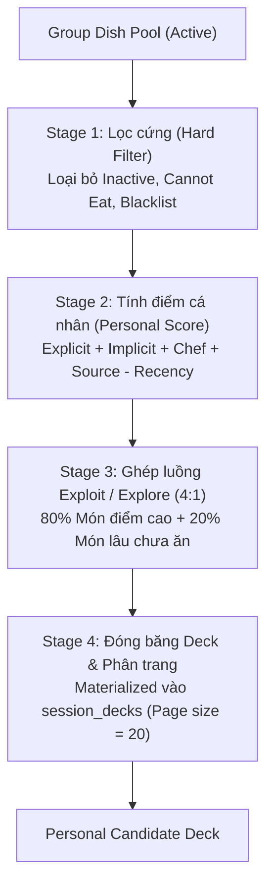

# 📊 Ranking Specification — What We Gonna Eat Today

> **Document Metadata**
>
> - **Version:** `1.2` | **Status:** `Approved`
> - **Created:** `2026-08-14` | **Last Updated:** `2026-08-14`
> - **Upstream:** [Problem Definition](what-we-gonna-eat-today_problem-definition_v1.3.md) • [Business Rules](what-we-gonna-eat-today_business-rules_v1.4.md) • [Decision Log](what-we-gonna-eat-today_decision-log_v1.1.md)
> - **Downstream:** [PRD](what-we-gonna-eat-today_prd_v0_1.md) • [SDD](what-we-gonna-eat-today_sdd_v0_1.md) • [Tech Spec](what-we-gonna-eat-today_tech-spec-architecture_v0_1.md)
>
> 📌 *Tài liệu đặc tả chi tiết thuật toán sắp xếp Personal Candidate Deck cho từng thành viên và thuật toán chấm điểm đồng thuận Session Ranking cho người tổ chức (Creator).*

---

## 📑 Mục lục (Table of Contents)

1. [Nguyên tắc thiết kế cốt lõi (Core Principles)](#1-nguyên-tắc-thiết-kế-cốt-lõi-core-principles)
2. [Quy trình tính toán Personal Candidate Deck (4 Stages)](#2-quy-trình-tính-toán-personal-candidate-deck-4-stages)
   - [2.1 Stage 1 — Lọc cứng (Hard Filter)](#21-stage-1--lọc-cứng-hard-filter)
   - [2.2 Stage 2 — Điểm số cá nhân (Personal Score)](#22-stage-2--điểm-số-cá-nhân-personal-score)
   - [2.3 Stage 3 — Xen kẽ Khai thác / Khám phá (Exploit/Explore Interleave)](#23-stage-3--xen-kẽ-khai-thác--khám-phá-exploitexplore-interleave)
   - [2.4 Stage 4 — Phân trang & Con trỏ (Paging & Cursor)](#24-stage-4--phân-trang--con-trỏ-paging--cursor)
   - [2.5 Quy tắc giải quyết hòa điểm (Tie-Break Hierarchy)](#25-quy-tắc-giải-quyết-hòa-điểm-tie-break-hierarchy)
   - [2.6 Khởi động nguội (Cold Start)](#26-khởi-động-nguội-cold-start)
   - [2.7 Tính toán lại giữa phiên (Recalculation in Active Session)](#27-tính-toán-lại-giữa-phiên-recalculation-in-active-session)
3. [Thuật toán chấm điểm Session Ranking](#3-thuật-toán-chấm-điểm-session-ranking)
4. [Cơ chế giải thích vị trí gợi ý (Explainability)](#4-cơ-chế-giải-thích-vị-trí-gợi-ý-explainability)
5. [Cấu hình trọng số tập trung (Ranking Configuration)](#5-cấu-hình-trọng-số-tập-trung-ranking-configuration)
6. [Ngoài phạm vi (Out of Scope)](#6-ngoài-phạm-vi-out-of-scope)
7. [Tác động lên tài liệu khác](#7-tác-động-lên-tài-liệu-khác)
8. [Các quyết định đã ghi nhận (DEC-012)](#8-các-quyết-định-đã-ghi-nhận-dec-012)
9. [Lịch sử thay đổi (Change History)](#9-lịch-sử-thay-đổi-change-history)

---

# 1. Nguyên tắc thiết kế cốt lõi (Core Principles)

1. **Xác định (Deterministic):** Cùng dữ liệu đầu vào $\to$ Cho ra cùng kết quả. Không sử dụng Machine Learning hộp đen hoặc online learning trong MVP.
2. **Có thể giải thích (Explainable):** Mỗi món xuất hiện trên Deck cá nhân đều có thể giải thích lý do vì sao nó nằm ở vị trí đó.
3. **Lọc trước, tính điểm sau (Filter first, score later):** Ràng buộc cứng (Hard constraint) không bao giờ được biểu diễn bằng trọng số âm lớn.
4. **Trọng số tập trung (Centralized Config):** Mọi hằng số và trọng số được định nghĩa tại một nơi duy nhất ([§5](#5-cấu-hình-trọng-số-tập-trung-ranking-configuration)).
5. **Quy định mâm cơm không tham gia chấm điểm:** Theo [DEC-011](what-we-gonna-eat-today_decision-log_v1.1.md), các rule `Required` / `Preferred` / `Target Count` không tham gia vào công thức xếp hạng.
6. **Gợi ý hỗ trợ, không quyết định thay:** Bảng xếp hạng là gợi ý khách quan; Creator luôn có quyền chọn món ngoài top ranking.

---

# 2. Quy trình tính toán Personal Candidate Deck (4 Stages)



## 2.1 Stage 1 — Lọc cứng (Hard Filter)

Một món ăn bị loại bỏ hoàn toàn khỏi Eligible Set nếu vi phạm **bất kỳ** điều kiện nào sau đây:

| Điều kiện loại trừ | Nguồn quy tắc |
| :--- | :--- |
| Trạng thái món trong nhóm là `INACTIVE` | [BR-005](what-we-gonna-eat-today_business-rules_v1.4.md) |
| Người dùng đánh dấu `Cannot Eat` đối với món này | [BR-034](what-we-gonna-eat-today_business-rules_v1.4.md) |
| Món ăn nằm trong `Blacklist` của người dùng | [BR-035](what-we-gonna-eat-today_business-rules_v1.4.md) |

> [!NOTE]
> Ràng buộc của thành viên khác **không** lọc Deck của người dùng này ([BR-033](what-we-gonna-eat-today_business-rules_v1.4.md)).

## 2.2 Stage 2 — Điểm số cá nhân (Personal Score)

$$\text{Score} = w_{\text{explicit}} \cdot E + w_{\text{implicit}} \cdot I + w_{\text{chef}} \cdot C + w_{\text{source}} \cdot S - w_{\text{recency}} \cdot R$$

### Thành phần $E$ — Sở thích rõ ràng (Explicit Preference $\in [-1, 1]$)

- Đặt `Like` $\to E = +1$
- `Neutral` / Chưa đặt $\to E = 0$
- Đặt `Dislike` $\to E = -1$ *(Dislike chỉ hạ điểm xếp hạng, không loại món khỏi Deck - [BR-037](what-we-gonna-eat-today_business-rules_v1.4.md))*

### Thành phần $I$ — Sở thích suy diễn (Implicit Preference $\in [-1, 1]$)

Tính từ lịch sử tương tác Swipe của chính User từ các phiên đã `FINALIZED`, có suy giảm theo thời gian (Time Decay):

$$\text{Weight}(t) = 0.5^{\frac{\text{AgeDays}(t)}{\text{HALF\_LIFE\_DAYS}}}$$
$$R_w = \sum \text{Weight}(t) \quad (\text{Swipe Right}), \quad L_w = \sum \text{Weight}(t) \quad (\text{Swipe Left})$$
$$I = \frac{R_w - L_w}{R_w + L_w + K_{\text{prior}}} \quad (\text{với } K_{\text{prior}} = 3)$$

### Thành phần $C$ — Bối cảnh đầu bếp (Chef Context $\in [0, 1]$)

- Khi bật Chef Mode: Đầu bếp có khả năng nấu (`Can Cook`) $\to C = 1$; Chưa rõ (`Unknown`) $\to C = 0$.
- Khi tắt Chef Mode: $C = 0$.

### Thành phần $S$ — Nguồn mua khả dụng (Purchase Source $\in [0, 1]$)

- Món có $\ge 1$ nguồn mua khả dụng trong nhóm $\to S = 1$; Không có $\to S = 0$.

### Thành phần $R$ — Điểm phạt lặp món (Recency Penalty $\in [0, 1]$)

Tính từ **Effective Eating History** của User với cửa sổ Cooldown 7 ngày:

$$R = \max\left(0, 1 - \frac{d}{7}\right)$$

| Số ngày kể từ lần ăn gần nhất ($d$) | Điểm phạt ($R$) |
| :---: | :---: |
| $d = 0$ (Ăn hôm nay) | `1.00` |
| $d = 1$ | `0.86` |
| $d = 3$ | `0.57` |
| $d = 6$ | `0.14` |
| $d \ge 7$ hoặc Chưa từng ăn | `0.00` |

> [!IMPORTANT]
> **Multi-source Collapse:** Ăn cùng 1 món ở 2 nhóm khác nhau trong cùng 1 ngày chỉ tính là **1 lần ăn duy nhất** khi tính Recency Penalty ([BR-056](what-we-gonna-eat-today_business-rules_v1.4.md)).

## 2.3 Stage 3 — Xen kẽ Khai thác / Khám phá (Exploit/Explore Interleave)

Deck được ghép theo từng khối 5 thẻ: **4 thẻ Exploit + 1 thẻ Explore** (tỉ lệ khám phá 20%):

```text
Vị trí thẻ:   #1    #2    #3    #4    #5    #6    #7    #8    #9    #10
Luồng ghép:  [EXP] [EXP] [EXP] [EXP] [NEW] [EXP] [EXP] [EXP] [EXP] [NEW]
```

- **Exploit Lane:** Lấy các món có `Score` cao nhất từ Stage 2.
- **Explore Lane:** Lấy các món chưa từng ăn hoặc đã $\ge 30\text{ ngày}$ chưa ăn (và chưa bị Dislike), sắp xếp theo $d$ giảm dần.

## 2.4 Stage 4 — Phân trang & Con trỏ (Paging & Cursor)

- Deck được materialize và lưu vào `session_decks` ở lần tải đầu tiên.
- Kích thước trang: `DECK_PAGE_SIZE = 20`.
- Khi duyệt hết món: Hiển thị trạng thái hết món và gợi ý nút "Tôi đã chọn xong".

## 2.5 Quy tắc giải quyết hòa điểm (Tie-Break Hierarchy)

1. Món lâu chưa ăn hơn ($d$ lớn hơn) được ưu tiên lên trước ($d = \infty$ cho món chưa ăn bao giờ).
2. Món có nguồn mua đã biết (`Purchase Source`) lên trước.
3. Băm ngẫu nhiên ổn định: `stable_hash(session_id, user_id, dish_id)` tăng dần.

## 2.6 Khởi động nguội (Cold Start)

Nhóm mới chưa có dữ liệu sẽ có $E = I = R = 0$. Thứ tự xuất hiện hoàn toàn do $C, S$ và thuật toán Tie-break quyết định. Hệ thống không tạo dữ liệu giả.

## 2.7 Tính toán lại giữa phiên (Recalculation in Active Session)

| Vùng Deck | Quy tắc xử lý khi người dùng đổi sở thích |
| :--- | :--- |
| `index < cursor` (Các thẻ đã xem qua) | **Đóng băng hoàn toàn.** Không đổi thứ tự, không xóa thẻ. |
| `index ≥ cursor` (Các thẻ chưa xem) | Tính lại điểm, sắp xếp lại và ghép lại block Exploit/Explore. |
| Thẻ bị Hard Filter (vừa mark Cannot Eat) | Loại bỏ ngay lập tức khỏi phần chưa xem. |

---

# 3. Thuật toán chấm điểm Session Ranking

Bảng xếp hạng tổng hợp phục vụ Creator, dựa **thuần túy trên bằng chứng (evidence)** tương tác trong phiên:

$$\text{Session Score} = \frac{1.00 \times P - 0.70 \times N - 1.00 \times X - 0.30 \times H}{T}$$

| Ký hiệu | Ý nghĩa đại diện | Trọng số |
| :---: | :--- | :---: |
| $T$ | Tổng số thành viên tham gia (Participant) hiện tại | Mẫu số chuẩn hóa |
| $P$ | Số người chọn thích (`Swipe Right`) | $+1.00$ |
| $N$ | Số người từ chối hôm nay (`Swipe Left`) | $-0.70$ |
| $X$ | Số người không ăn được (`Cannot Eat`) | $-1.00$ |
| $H$ | Số người vừa ăn trong 7 ngày qua | $-0.30$ |

> [!NOTE]
>
> - Luôn hiển thị các số đếm thô $P / N / X / H$ đi kèm điểm số để Creator có thông tin minh bạch.
> - Creator không có trọng số riêng; phiếu của Creator được tính bình đẳng như mọi thành viên khác.

---

# 4. Cơ chế giải thích vị trí gợi ý (Explainability)

Mỗi món trên Deck cá nhân trả về tối đa **2 reason codes** nổi bật nhất:

| Reason Code | Điều kiện kích hoạt |
| :--- | :--- |
| `LIKED` | Người dùng đã đánh dấu `Like` ($E = +1$) |
| `DISLIKED` | Người dùng đã đánh dấu `Dislike` ($E = -1$) |
| `OFTEN_CHOSEN` | Thường xuyên được vuốt chọn ($I \ge 0.3$) |
| `OFTEN_SKIPPED` | Thường xuyên bị bỏ qua ($I \le -0.3$) |
| `RECENTLY_EATEN` | Vừa mới ăn gần đây ($R > 0$) |
| `CHEF_CAN_COOK` | Đầu bếp trong phiên nấu được ($C = 1$) |
| `NEW_TO_YOU` | Món mới từ Explore Lane (chưa ăn bao giờ) |
| `LONG_TIME_NO_EAT` | Món cũ từ Explore Lane ($\ge 30\text{ ngày}$ chưa ăn) |

---

# 5. Cấu hình trọng số tập trung (Ranking Configuration)

```yaml
personal_ranking:
  w_explicit: 0.30
  w_implicit: 0.25
  w_recency:  0.25
  w_chef:     0.10
  w_source:   0.10

implicit:
  half_life_days: 60
  prior_k: 3

history:
  cooldown_window_days: 7

explore:
  ratio: 0.20            # 1 thẻ trong mỗi 5 vị trí
  block_size: 5
  stale_days: 30

deck:
  page_size: 20

session_ranking:
  a_swipe_right: 1.00
  b_swipe_left:  0.70
  c_cannot_eat:  1.00
  d_recent:      0.30
```

---

# 6. Ngoài phạm vi (Out of Scope)

- Học trọng số tự động bằng Bandit Algorithms hoặc A/B Testing trực tuyến.
- Phạt lặp món theo cấp độ Tag (Canh, Mặn) hoặc theo nguyên liệu cụ thể.
- Đánh giá sự kết hợp tương thích giữa các cặp món ăn (Dish Compatibility).
- Collaborative Filtering giữa các nhóm người dùng không quen biết nhau.

---

# 7. Tác động lên tài liệu khác

- **Decision Log:** Ghi nhận quyết định [DEC-012](what-we-gonna-eat-today_decision-log_v1.1.md).
- **Business Rules:** Thu hẹp phạm vi Cooldown và Whitelist về cấp độ món ăn.
- **Problem Definition:** Làm rõ Session Ranking thuần túy dựa trên bằng chứng thực tế.

---

# 8. Các quyết định đã ghi nhận (DEC-012)

1. Personal Ranking sử dụng mô hình điểm tuyến tính, xác định (deterministic) và giải thích được.
2. Implicit Preference áp dụng hàm phân rã chu kỳ bán rã 60 ngày với prior $K = 3$, chỉ học từ phiên `FINALIZED`.
3. Cooldown window cố định 7 ngày theo hàm tuyến tính ở cấp độ món ăn.
4. Explore Lane cố định tỉ lệ 20% theo block 4+1.
5. Đóng băng các thẻ đã xem khi tính lại điểm giữa phiên.

---

# 9. Lịch sử thay đổi (Change History)

| Version | Ngày | Phần tác động | Nội dung thay đổi | Cơ sở / Quyết định |
| :---: | :---: | :--- | :--- | :--- |
| `0.2` | 2026-08-14 | Toàn bộ | Chuyển đổi toàn bộ tham chiếu sang hệ thống mã `BR-ID` | Đồng bộ PRD v0.1 |
| `0.1` | 2026-08-14 | Toàn bộ | Bản thảo đầu tiên: Personal Score, Explore Lane, Session Ranking | Khởi tạo baseline [DEC-012](what-we-gonna-eat-today_decision-log_v1.1.md) |
