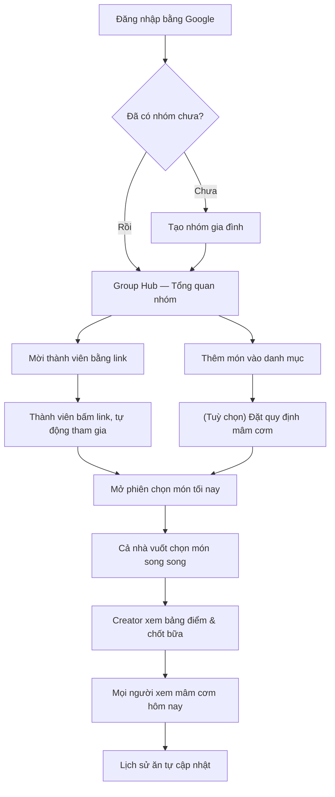

# 📖 User Guide — Happy Path v1.0

> **Document Metadata**
>
> - **Version:** `1.0` | **Status:** `Draft` | **Release:** `R1 (v1.0)`
> - **Created:** `2026-08-25` | **Last Updated:** `2026-08-25`
> - **Upstream:** [PRD](what-we-gonna-eat-today_prd_v0_1.md) • [Master Plan](what-we-gonna-eat-today_master-plan_v1_0.md) • [Design Criteria](what-we-gonna-eat-today_design-criteria_v0_1.md)
>
> 📌 *Hướng dẫn sử dụng theo đúng luồng "happy case" của v1.0: từ đăng nhập tới lúc cả nhà nhìn thấy mâm cơm tối nay. Nhãn nút, tên màn hình lấy verbatim từ code hiện hành — không phải bản nháp thiết kế. Dành cho người dùng cuối và người onboard thành viên mới trong đội.*

---

## 📑 Mục lục

1. [Hai vai trò trong hệ thống](#1-hai-vai-trò-trong-hệ-thống)
2. [Sơ đồ luồng tổng quan](#2-sơ-đồ-luồng-tổng-quan)
3. [Bước 1 — Đăng nhập](#bước-1--đăng-nhập)
4. [Bước 2 — Tạo nhóm gia đình](#bước-2--tạo-nhóm-gia-đình)
5. [Bước 3 — Mời thành viên](#bước-3--mời-thành-viên)
6. [Bước 4 — Thêm món ăn vào danh mục](#bước-4--thêm-món-ăn-vào-danh-mục)
7. [Bước 5 — (Tuỳ chọn) Đặt quy định mâm cơm](#bước-5--tuỳ-chọn-đặt-quy-định-mâm-cơm)
8. [Bước 6 — Mở phiên chọn món](#bước-6--mở-phiên-chọn-món)
9. [Bước 7 — Vuốt chọn món](#bước-7--vuốt-chọn-món)
10. [Bước 8 — Chốt bữa (Creator)](#bước-8--chốt-bữa-creator)
11. [Bước 9 — Xem mâm cơm hôm nay](#bước-9--xem-mâm-cơm-hôm-nay)
12. [Bước 10 — Xem lịch sử ăn](#bước-10--xem-lịch-sử-ăn)
13. [Những gì happy path này KHÔNG bao gồm](#3-những-gì-happy-path-này-không-bao-gồm)

---

# 1. Hai vai trò trong hệ thống

| Vai trò | Là ai | Làm được gì |
| :--- | :--- | :--- |
| **Creator / Admin** | Người tạo nhóm, thường là người nấu ăn chính | Mọi việc của Member, **cộng thêm**: mời thành viên, đặt quy định mâm cơm, mở phiên, chốt bữa |
| **Member / Participant** | Thành viên gia đình tham gia qua link mời | Vuốt chọn món trong phiên, xem mâm cơm đã chốt, xem lịch sử ăn |

> [!NOTE]
> Một User chỉ thuộc **một** Group trong v1.0 ([DEC-004](what-we-gonna-eat-today_decision-log_v1.1.md), ngoài phạm vi tới v1.2+).

---

# 2. Sơ đồ luồng tổng quan

---

## Bước 1 — Đăng nhập

**Màn hình:** `S-01` Đăng nhập

- Mở app, bấm **"Đăng nhập"** → xác thực qua Google OAuth.
- Không có form tạo tài khoản riêng — tài khoản Google là danh tính duy nhất.

---

## Bước 2 — Tạo nhóm gia đình

**Đường dẫn:** `/groups` → `/groups/new`

- Nếu chưa thuộc nhóm nào, bấm **"Tạo nhóm"**.
- Nhập tên nhóm (VD: *"Nhà Bảy Hiền"*) và chọn **múi giờ IANA** — múi giờ này quyết định "hôm nay" của cả nhóm kết thúc lúc nào (Decision Date theo timezone Group).
- Người tạo nhóm tự động là **Admin**.

---

## Bước 3 — Mời thành viên

**Màn hình:** `S-13` Mời thành viên — `/groups/[groupId]/invite`

1. Từ Group Hub, chọn mục mời thành viên.
2. Bấm **"Tạo link mời"** → hệ thống hiện **"Link mời tham gia"**.
3. Bấm **"Sao chép link"** → gửi qua Zalo/Messenger cho người nhà.
4. Cần mời thêm người khác? Bấm **"Tạo link cho người tiếp theo"**.

> [!NOTE]
> Link mời hết hạn sau 7 ngày và chỉ Admin mới tạo được. DB chỉ lưu **hash** của token, không lưu token thô.

**Phía thành viên:** mở link → tự động vào nhóm, không cần duyệt thủ công.

---

## Bước 4 — Thêm món ăn vào danh mục

**Màn hình:** `S-05`/`S-06` Danh mục & Thêm món — `/groups/[groupId]/dishes`

- Bấm **"Thêm món đầu tiên"** (hoặc **"Thêm món"** nếu danh mục đã có món).
- Gõ tên món — hệ thống tự **chuẩn hoá tên** (bỏ dấu) để phát hiện trùng. Ví dụ gõ *"Ca kho"* khi đã có *"Cá kho"* → hệ thống gợi ý dùng lại món cũ thay vì tạo trùng.
- Gán **System Tag**: `Món cơm` / `Món mặn` / `Món phụ` / `Món canh` / `Tráng miệng` — dùng để tính quy định mâm cơm và lọc ở bước chốt bữa.
- Ví dụ món mẫu hệ thống gợi ý: *Cá basa kho tiêu, Canh chua cá lóc, Gà chiên nước mắm.*

> [!IMPORTANT]
> Nhóm **chưa có món nào** thì server sẽ **từ chối** mở phiên (không chỉ ẩn nút trên UI) — đây là chốt chặn `E6-T4`.

---

## Bước 5 — (Tuỳ chọn) Đặt quy định mâm cơm

**Màn hình:** `Quy định bữa ăn` — `/groups/[groupId]/rules` (chỉ Admin sửa được)

- Bấm **"Thêm quy định"** → chọn System Tag + số lượng tối thiểu. Ví dụ: *"Phải có ít nhất 1 món mặn"*, *"Phải có ít nhất 1 món canh"*.
- Bấm **"Lưu quy định"** để áp dụng.
- Không đặt quy định nào cũng được — hệ thống nói rõ: *"Chưa có quy định nào. Lúc chốt bữa sẽ không có gì được kiểm tra — thiếu canh hay thiếu món mặn cũng chốt được."*
- Member chỉ **xem**, không thấy nút sửa.

> [!NOTE]
> Quy định được **snapshot** vào lúc mở phiên — sửa quy định giữa chừng phiên đang chạy không ảnh hưởng phiên đó.

---

## Bước 6 — Mở phiên chọn món

**Màn hình:** `S-08` Mở phiên — `/groups/[groupId]/sessions/new`

- Từ Group Hub, bấm mở phiên → màn hiện **"Mở phiên tối nay"** kèm ngày hôm nay (VD: *"Thứ Ba · 19 tháng 8"*).
- Hệ thống revalidate 5 bước (thành viên còn hợp lệ, nhóm còn món, v.v.) — ai không hợp lệ hiện **ngay tại hàng** của người đó, không phải thông báo chung chung.
- Bấm **"Bắt đầu phiên với N người"** để khởi động.
- Người mở phiên tự động là người **chốt bữa** cuối cùng.

> [!NOTE]
> Chỉ **một** phiên `ACTIVE` mỗi ngày mỗi nhóm — đảm bảo bằng partial unique index ở DB, không phải kiểm tra ở tầng ứng dụng.

---

## Bước 7 — Vuốt chọn món

**Màn hình:** `S-07`/`S-09` Deck vuốt — `/sessions/[sessionId]` (mỗi thành viên tự vào bằng điện thoại của mình)

- Mỗi thẻ hiện 1 món, kèm lý do gợi ý (VD: lâu chưa ăn).
- Hai nút chính ở nửa dưới màn hình:
  - **"Không hôm nay"** — bỏ qua món này.
  - **"Đề xuất"** — muốn ăn món này tối nay.
- **"Hoàn tác"** — sửa lại lượt vuốt vừa rồi nếu bấm nhầm.
- Vuốt hết deck hoặc chưa muốn vuốt tiếp: bấm **"Tôi chọn xong"** — vẫn có thể **mở lại vuốt tiếp** sau đó, không bị khoá.
- Mất mạng giữa chừng không chặn thao tác — hệ thống tự gửi lại khi có mạng, có dải thông báo ở đỉnh màn hình.

---

## Bước 8 — Chốt bữa (Creator)

**Màn hình:** `S-10` Tổng hợp phiên — `/sessions/[sessionId]/summary` (chỉ người mở phiên nhìn thấy)

- Xem bảng điểm đồng thuận của cả nhóm theo từng món (Session Score).
- Chọn món cho từng nhóm tag: `Món cơm`, `Món mặn`, `Món phụ`, `Món canh`, `Tráng miệng` — kể cả món nằm trong mục "Chưa ai chọn".
- Nếu chưa đạt quy định (Bước 5), nút chốt hiện rõ: *"Còn thiếu: 1 món Canh"* — không dùng popup, hiện ngay tại chỗ.
- Đủ điều kiện, nút đổi thành **"Chốt bữa"** → bấm để xác nhận (server chạy revalidate đầy đủ trong 1 transaction, không chỉ tin UI).
- Sau khi chốt: phiên chuyển `FINALIZED`, **không mở lại được**, và hệ thống tự ghi Eating History cho từng thành viên trong cùng transaction đó.

---

## Bước 9 — Xem mâm cơm hôm nay

**Màn hình:** `S-11` Bữa ăn hôm nay — `/sessions/[sessionId]/meal`

- Mọi Member trong nhóm đều xem được (quyền xem không giới hạn, chỉ quyền **chọn** mới giới hạn ở Creator).
- Group Hub cũng hiện luôn chip tóm tắt: *"Đã chốt lúc 17:42 · Mẹ chốt"* kèm tên món, bấm vào để xem chi tiết.

---

## Bước 10 — Xem lịch sử ăn

**Màn hình:** `Lịch sử ăn` — `/groups/[groupId]/history`

- Xem 30 ngày ăn gần nhất, nhóm theo ngày.
- Dữ liệu này chính là nguồn để thuật toán ranking tính **độ lâu chưa ăn** (recency penalty) cho các phiên sau — vòng lặp khép kín của sản phẩm.

---

# 3. Những gì happy path này KHÔNG bao gồm

Các tính năng sau **cố ý chưa có** ở v1.0, đã nằm trong roadmap v1.1/v1.2 ([Master Plan §13](what-we-gonna-eat-today_master-plan_v1_0.md)) — không phải lỗi thiếu sót:

| Tính năng | Vì sao chưa có ở v1.0 |
| :--- | :--- |
| Khai báo "Không ăn được" (dị ứng, kiêng) | `F15`, dự kiến v1.1 |
| Like/Dislike cá nhân | `F16`, dự kiến v1.1 |
| Explore Lane (khám phá món lạ) | `F18`, dự kiến v1.1 |
| Chef Role & Khả năng nấu | `F33/F34`, dự kiến v1.2 |
| Gỡ Participant / Sửa Final Meal / Huỷ phiên | `F25`, `F40`, `F41`, dự kiến v1.1/v1.2 |
| Một User thuộc nhiều Group | `F43`, ngoài phạm vi cốt lõi |

---

# 4. Lịch sử thay đổi (Change History)

| Version | Ngày | Nội dung |
| :---: | :---: | :--- |
| `0.1` | 2026-08-25 | Bản thảo đầu tiên — happy path 10 bước từ đăng nhập tới lịch sử ăn, đối chiếu verbatim với copy trong code v1.0 (Cột mốc M6) |
